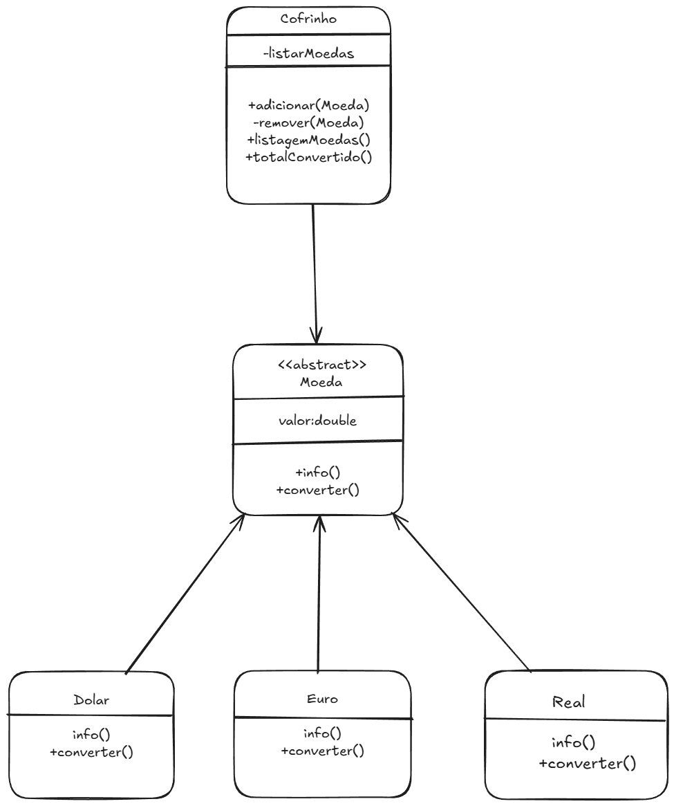

# UNINTER

## CST - ANÁLISE E DESENVOLVIMENTO DE SISTEMAS
 

## ATIVIDADE PRÁTICA
### Programação Orientada a Objetos
 

### Prof.: Leonardo Gomes, Dr.
### Aluno: Lucas Santos
###### Projeto entregue: 03/12/2025
 

### Visão Geral 🚨
Entrega de Trabalho acadêmico de forma documentada, seguindo os requisitos de boas práticas de programação Java.
Este projeto implementa um sistema básico de cofrinho em Java, utilizando conceitos fundamentais de Programação Orientada a Objetos, como:
  
    - Abstração
    - Herança
    - Polimorfismo
    - Sobrescrita de métodos
    - Equals/HashCode customizados
    - Coleções (ArrayList)
    - Tratamento de exceções
    - BigDecimal para precisão monetária

O Sistema permite realizar as seguintes operações:

    ✔ Adicionar moedas (Real, Dólar, Euro)
    ✔ Remover moedas por tipo + valor exatos
    ✔ Listar o conteúdo do cofrinho
    ✔ Converter todas as moedas automaticamente para Real

O projeto inclui diversas validações e segue boas práticas para cálculo monetário e formatação.
Utilizamos a plataforma GitHub para hospedar este projeto.
 

### 1. OBJETIVO 🔎
O trabalho consiste em realizar a construção e implementação de um pequeno sistema que emula um "Cofrinho
de moedas" em Java. As especificações abstratas de código são descritas abaixo.

Criar um menu em que é oferecido ao usuário via input:
- Adicionar moedas de diferentes valores e países em seu cofrinho.
- Remover moedas específicas do cofrinho.
- Listar todas as moedas que estão dentro do cofrinho.
- Calcular quanto dinheiro existe no cofrinho convertido para Real.

O objetivo principal deste trabalho é avaliar o bom uso do conceito de herança e
polimorfismo. O projeto deve possuir uma classe Principal além das classes descritas no
diagrama UML abaixo.

A classe Cofrinho deve possuir como atributo uma coleção de Moedas, que por sua
vez é uma classe mãe abstrata de outras classes específicas de Dolar, Euro, Real, etc... A
coleção de Moedas pode ser implementada utilizando um ArrayList, ou qualquer outra
estrutura de dados que julgue pertinente.
Demais detalhes de implementação ficam a cargo do aluno que pode desenvolver
também classes extras ou adicionar métodos e atributos conforme julgar necessário.

### 2. MATERIAL UTILIZADO 📝

- IDE: Intellij

- Liguagem de programação: Java

- Sistema de Controle de versão: Github

### 3. Execução 👨‍💻

Exemplo de código em execução (passo a passo):

    1. Usuário inicia programa → vê menu principal.
    2. Escolhe 1 (Adicionar moeda) → sub-menu pergunta tipo (1: Real).
        Digita 1 → pede valor → digita 10.50 → valida → cria Real(BigDecimal("10.50")) → chama cofrinho.adicionar(...) → imprime confirmação.

    3. Escolhe 1 novamente → adiciona Dólar 2.00 → cria Dolar(BigDecimal("2.00")) → adiciona.
    4. Escolhe 3 (Listar) → Cofrinho.listar() chama info() de cada moeda → imprime:
        Real - R$ 10.50
        Dólar - US$ 2.00

    5. Escolhe 4 (Total em Real) → cofrinho.totalConvertido():
        Real.converter() => 10.50
        Dolar.converter() => 2.00 * 5.60 = 11.20 (arredondado)
        Soma = 21.70 → Principal imprime Total convertido para Real: R$ 21.70

    6. Escolhe 2 (Remover) → pede tipo+valor → informa 2 (Dólar) e 2.00 → instancia temporária new Dolar(BigDecimal("2.00")) → cofrinho.remover(...) usa equals() → encontra e remove a moeda correspondente → imprime sucesso.
    7. Escolhe 3 → lista apenas Real - R$ 10.50

#### Sobre o Desenvolvedor: 😎
[Lucas Santos](https://www.linkedin.com/in/lukaz-devops/) responsável pela elaboração do código deste projeto, aplicando na prática através deste, os ensinamentos adquiridos neste modulo de POO com Java, admito que ao longo desta jornada de descobertas e aprendizados estive imerso em uma intensa rotina de estudos.

Caso tenha algum feedback, ou relato a fazer, estou aberto a conversação em minha rede através do [LinkedIn](https://www.linkedin.com/in/lukaz-devops/).